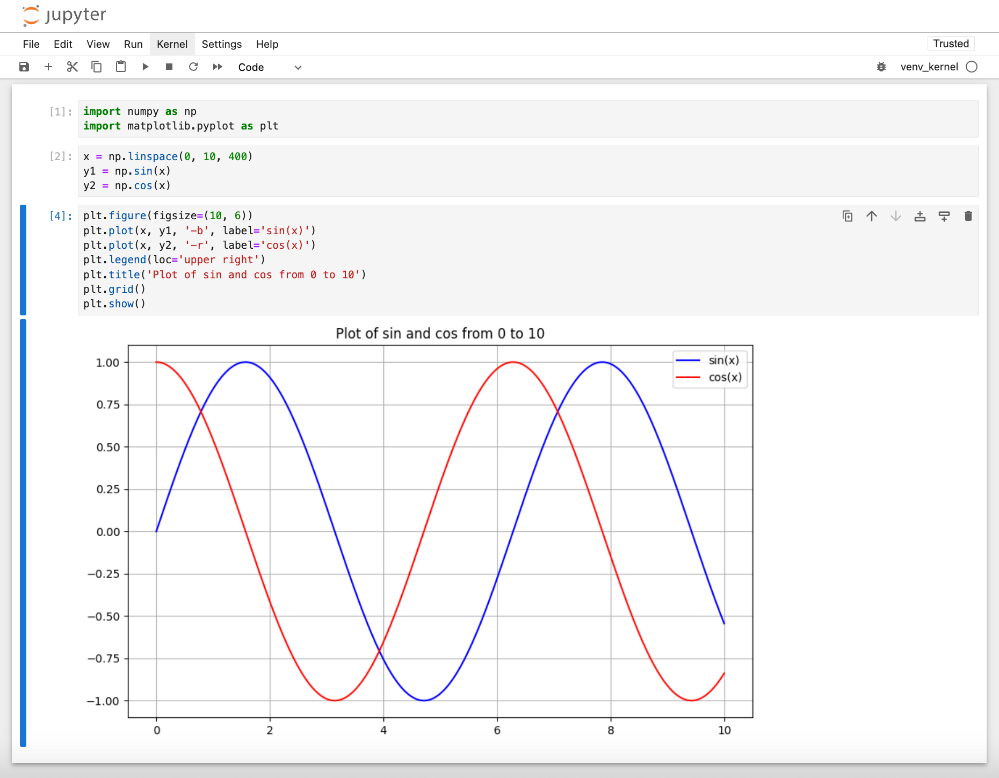
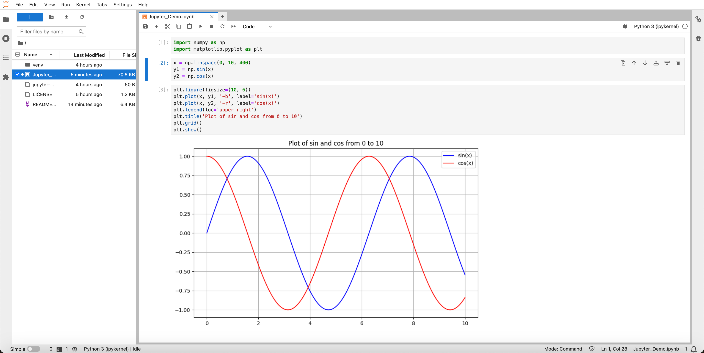

<!-- Begin README -->

<div align="center">
    <a href="https://github.com/scottgriv/jupyter-notebook-demo_notebook" target="_blank">
        
    </a>
</div>
<br>
<p align="center">
    <a href="https://jupyter-notebook.readthedocs.io/en/stable/changelog.html"></a>
    <br>
    <a href="https://github.com/scottgriv"></a>
    <a href="mailto:scott.grivner@gmail.com"></a>
    <a href="https://www.buymeacoffee.com/scottgriv"></a>
    <br>
    <a href="https://prgportfolio.com" target="_blank"></a>
</p>

---------------

<h1 align="center">Jupyter Notebook - Demo Notebook</h1>

A demo for using **Jupyter Notebooks** with `Python`.
- Jupyter Notebooks are used for data science and machine learning. 
- They are also a great way to share code and documentation in a single file. 
- This demo will show you how to install Jupyter Notebooks and how to use them.
- **Jupyter Lab** is a newer version of Jupyter Notebooks that is more powerful and easier to use (also covered in this demo).

<div align="center">
    <a href="https://jupyter.org/" target="_blank">
        
    </a>
    <br>
    <i>Jupyter Notebook UI.</i>
</div>
<div align="center">
    <a href="https://jupyterlab.readthedocs.io/en/stable/" target="_blank">
        
    </a>
    <br>
    <i>Jupyter Lab UI.</i>
</div>

---------------

## Table of Contents

- [Getting Started](#getting-started)
- [Resources](#resources)
    - [Online Jupyter Notebooks](#online-jupyter-notebooks)
    - [Jupyter Notebook](#jupyter-notebook)
    - [Jupyter Lab](#jupyter-lab)
- [License](#license)
- [Credits](#credits)

## Getting Started

Setting Up and Using Jupyter Notebooks with Virtual Environment:

1. Install [Python](https://www.python.org/downloads/) on your computer.

2. Navigate to your project directory in the terminal and create a new virtual environment. Name it (for example, venv):

```bash
python3 -m venv venv
```
3. Activate the virtual environment:

```bash 
source venv/bin/activate
```
4. Install the required packages:

```bash
pip3 install jupyter matplotlib numpy ipykernel
```

5. Install the kernal for Jupiter Notebooks:
```bash
python3 -m ipykernel install --user --name=venv
```

6. Build the notebook 
```bash
jupyter lab build 
```

7. Start the notebook server:
```bash
jupyter notebook
```
or start Jupiter Lab
```bash
jupyter lab
```

8. This will open the Jupyter Notebook interface in your default browser. From here you can create a new notebook or open an existing one like the [notebook included in this repository](Jupyter_Demo.ipynb).

## Resources

### Online Jupyter Notebooks

**Try Jupyter** is an online Jupyter Notebook that allows you to run Python code in the cloud. It is a great way to get started with Jupyter Notebooks without having to install anything on your computer.
- [Try Jupyter](https://jupyter.org/try)

**Google Colab** is an online Jupyter Notebook that allows you to run Python code in the cloud. It is a great way to get started with Jupyter Notebooks without having to install anything on your computer.
- [Google Colab](https://colab.research.google.com/notebooks/intro.ipynb)
- [Google Colab Tutorial](https://www.youtube.com/watch?v=inN8seMm7UI)

**Kaggle** is another online Jupyter Notebook that allows you to run Python code in the cloud. It is a great way to get started with Jupyter Notebooks without having to install anything on your computer.
- [Kaggle](https://www.kaggle.com/)
- [Kaggle Documentation](https://www.kaggle.com/docs/notebooks)

**NBViewer** is a web service that allows you to view Jupyter Notebooks online. It is a great way to share your notebooks with others.
- [NBViewer](https://nbviewer.jupyter.org/)

**Deepnote** is another online Jupyter Notebook that allows you to run Python code in the cloud. It is a great way to get started with Jupyter Notebooks without having to install anything on your computer.
- [Deepnote](https://deepnote.com/)
- [Deepnote Documentation](https://docs.deepnote.com/)

**Binder** is a web service that allows you to run Jupyter Notebooks online. It is a great way to share your notebooks with others.
- [Binder](https://mybinder.org/)
- [Binder Tutorial](https://www.youtube.com/watch?v=owSGVOov9pQ)

**Databricks Community Edition** is a web service that allows you to run Jupyter Notebooks online. It is a great way to share your notebooks with others.
- [Databricks Community Edition](https://community.cloud.databricks.com/)
- [Databricks Community Edition Tutorial](https://www.youtube.com/watch?v=7wfPqAyYADY)

**Streamlit** is a another web service that allows you to run Jupyter Notebooks online. It is a great way to share your notebooks with others. 
- [Streamlit](https://streamlit.io/)
- [Streamlit Documentation](https://docs.streamlit.io/en/stable/)
- [Streamlit Tutorial](https://www.youtube.com/watch?v=JwSS70SZdyM)
- [Build A Beautiful Machine Learning Web App With Streamlit And Scikit-learn | Python Tutorial](https://youtube.com/watch?v=Klqn--Mu2pE)

### Jupyter Notebook

- [Jupyter Notebook](https://jupyter.org/)
- [Jupyter Notebook Documentation](https://jupyter-notebook.readthedocs.io/en/stable/)
- [Jupyter Notebook Tutorial](https://www.dataquest.io/blog/jupyter-notebook-tutorial/)
- [Jupyter Notebook Tutorial: The Ultimate Guide](https://www.datacamp.com/community/tutorials/tutorial-jupyter-notebook)
- [Jupyter Notebook Tutorial: Introduction, Setup, and Walkthrough](https://www.youtube.com/watch?v=HW29067qVWk)

### Jupyter Lab

- [Jupyter Lab](https://jupyterlab.readthedocs.io/en/stable/)
- [Jupyter Lab Tutorial](https://www.youtube.com/watch?v=7wfPqAyYADY)

## License

This project is released under the terms of **The Unlicense**, which allows you to use, modify, and distribute the code as you see fit. 
- [The Unlicense](https://choosealicense.com/licenses/unlicense/) removes traditional copyright restrictions, giving you the freedom to use the code in any way you choose.
- For more details, see the [LICENSE](LICENSE) file in this repository.

## Credits

**Author:** [Scott Grivner](https://github.com/scottgriv) <br>
**Email:** [scott.grivner@gmail.com](mailto:scott.grivner@gmail.com) <br>
**Website:** [scottgrivner.dev](https://www.scottgrivner.dev) <br>
**Reference:** [Main Branch](https://github.com/scottgriv/jupyter-notebook-demo_notebook) <br>

---------------

<div align="center">
    <a href="https://scottgrivner.dev" target="_blank">
        
    </a>
</div>

<!-- End README -->